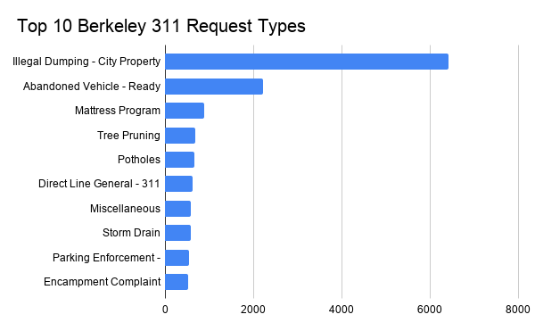
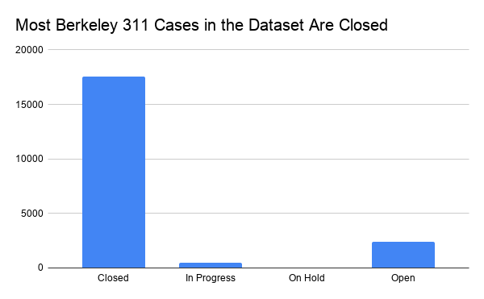

# berkeley-311-data-story

# Illegal dumping dominates Berkeley 311 reports

## Introduction: Why this matters

This project looks at 311 service request data from Berkeley, California. A 311 case is a non-emergency request or complaint that residents can submit to the city, such as illegal dumping, potholes, tree issues, abandoned vehicles, parking enforcement requests, or storm drain problems. These cases matter because they show the kinds of everyday city problems residents are asking the government to address.

The main question I wanted to answer was: **What types of problems show up most often in Berkeley’s 311 data, and what can this tell us about city services?** I focused on reported cases, case types, and case statuses. The goal is not to prove what Berkeley’s “biggest problem” is overall, because the 311 data only includes issues that were reported. Instead, this project tells a narrower story: among the cases in this dataset, illegal dumping and abandoned-vehicle complaints account for a major share of reported 311 activity.

## Data source and potential challenges

The dataset used for this project came from the City of Berkeley Open Data Portal: [City of Berkeley 311 Cases dataset](https://data.cityofberkeley.info/311/311-Cases/p88g-6gs2/about_data). The dataset contains 20,430 rows and 11 columns. The columns include `Case_ID`, `Date_Opened`, `Case_Status`, `Last_Action_Date`, `Date_Closed`, `Case_Request`, `Street_Address`, `City`, `State`, `Latitude`, and `Longitude`.

The source of this data is the City of Berkeley’s 311 case system. This means the data was likely generated when residents or city staff submitted and managed service requests. Because it comes from a city government open data portal, it is a useful and relevant source for understanding reported city service issues. However, public government data should not automatically be treated as complete or perfect. A journalist would still need to ask how the city collects these cases, whether all types of residents have equal access to 311 reporting, whether duplicate reports exist, and whether some categories are used more consistently than others.

One major challenge is that 311 data shows reported problems, not all problems. A high number of reports could mean that an issue happens often, but it could also mean that residents are more likely to report that issue. Some communities may know about 311 or have time to report issues more often than others. Another challenge is that the dataset includes street addresses, latitude, and longitude. That location data can be useful for analysis, but it could also stigmatize certain blocks or neighborhoods if it is presented without context.

## Questions I asked

1. What types of 311 cases appear most often in this dataset?
2. What share of cases were closed, open, in progress, or on hold?
3. What can this data show about reported city problems, and what can it not show?

## Methods

I imported the CSV file into Google Sheets and used pivot tables to analyze the data. I did not use Microsoft Excel or Apple Numbers. For the first analysis, I created a pivot table with `Case_Request` in the rows section and a count of `Case_ID` in the values section. This showed how many cases appeared in each request category. I sorted the results from highest to lowest and used the top 10 request types to create the first chart.

For the second analysis, I created another pivot table with `Case_Status` in the rows section and a count of `Case_ID` in the values section. This showed how many cases were closed, open, in progress, or on hold. I used this pivot table to create the second chart.

Google Sheet with pivot tables and charts: [https://docs.google.com/spreadsheets/d/1Wj5_CtwgZoFgfJmdz6EsAXsyvX7RiKtKXP2O4iXX1cM/edit?usp=sharing]

## Finding 1: Illegal dumping was the most common reported 311 request type

The most common request type in the dataset was **Illegal Dumping - City Property**, with **6,414 cases**. This was much higher than the second most common category, **Abandoned Vehicle - Ready for PD (Parking Enforcement)**, which had **2,203 cases**. Other common categories included mattress program requests, tree pruning, potholes, general 311 direct line cases, miscellaneous requests, storm drain problems, parking enforcement requests, and encampment complaints.

This finding suggests that visible street-level issues make up a large part of Berkeley’s reported 311 activity. Illegal dumping alone made up about 31% of all cases in the dataset. The top 10 request types together made up 13,634 of the 20,430 cases, or about 67% of the dataset. This means a small number of request categories accounted for a large share of the total reports.

Caption: Illegal dumping on city property was the most common 311 request type in this dataset, with 6,414 cases. Abandoned vehicle complaints were second, with 2,203 cases. Source: City of Berkeley Open Data Portal, 311 cases dataset.

## Finding 2: Most cases were marked closed

The second chart looks at case status. Most cases in the dataset were marked **Closed**. Out of 20,430 total cases, **17,556** were closed. Another **2,389** were open, **475** were in progress, and **10** were on hold.

This shows that the majority of cases in the dataset had been marked as completed by the time the data was downloaded. However, the status categories should be interpreted carefully. A “closed” case does not necessarily prove that the problem was fully solved to the resident’s satisfaction. It only means the city’s case system marked the request as closed. Similarly, an open or in-progress case may not mean the city is ignoring the issue; it may mean the case takes more time, requires inspection, or depends on another department.

Caption: Most Berkeley 311 cases in this dataset were marked closed, while 2,389 were open and 475 were in progress. Source: City of Berkeley Open Data Portal, 311 cases dataset.

## Limitations

This dataset is useful, but it has several important limitations. First, it only shows the reported 311 cases. It does not show every instance of illegal dumping, abandoned vehicles, potholes, or other city problems. Some issues may never be reported. Other issues may be reported multiple times.

Second, the data does not explain why some categories are more common than others. For example, illegal dumping may be common because it happens frequently, because it is easy to notice, because residents are more likely to report it, or because the city categorizes many sanitation-related issues under that label. The dataset alone cannot separate those possibilities.

Third, the dataset includes case statuses, but it does not fully measure government performance. A closed case is not the same thing as a successfully resolved case. To evaluate city performance, a journalist would need more information about response times, resident satisfaction, staffing, department procedures, and whether the problem actually disappeared after the case was closed.

Finally, the dataset includes location information, including street addresses and coordinates. While this can be useful for mapping, it can also create ethical risks if certain neighborhoods are portrayed as “problem areas” without considering reporting differences, city resources, housing conditions, or other context.

## Ethical concerns and additional reporting

This data could unintentionally harm or misrepresent communities if it is presented too simply. For example, if a map showed exact locations of illegal dumping or encampment complaints, readers might blame certain blocks, neighborhoods, or unhoused residents without understanding the larger causes. High report counts might reflect reporting behavior, city cleanup patterns, or unequal access to 311, not just the true number of problems.

To make this a more complete and ethical story, I would need to do additional reporting beyond the dataset. I would want to interview Berkeley city staff who manage 311 cases and ask how request categories are assigned, how duplicate cases are handled, and what “closed” means in practice. I would also want to talk to residents who use 311 and residents who do not, because some people may face barriers to reporting city service problems. Finally, I would compare this dataset with other records, such as sanitation cleanup data, parking enforcement data, department staffing levels, and city budget information.

## Conclusion

The clearest pattern in this dataset is that illegal dumping was the most common reported 311 request type in Berkeley, followed by abandoned vehicle complaints. Most cases were marked closed, but the data does not prove that every issue was fully resolved. Overall, this dataset is best understood as a record of reported city service requests, not a complete measurement of every problem in Berkeley. It can help identify patterns in what people report to the city, but it needs interviews, context, and additional records to become a complete public-interest story.

## Links

- Original data source: [City of Berkeley 311 Cases dataset](https://data.cityofberkeley.info/311/311-Cases/p88g-6gs2/about_data)
- Google Sheet analysis: [Google Sheet with pivot tables and charts](https://docs.google.com/spreadsheets/d/1Wj5_CtwgZoFgfJmdz6EsAXsyvX7RiKtKXP2O4iXX1cM/edit?usp=sharing)
